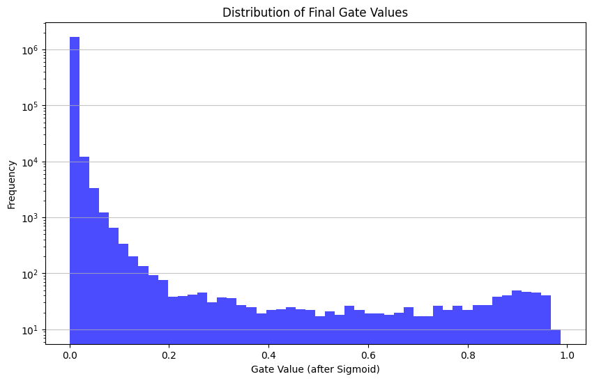

# Self-Pruning Neural Network

This is a PyTorch implementation of a feed-forward neural network that learns how to prune its own weights on the fly during training. 

Instead of training a massive model and stripping it down later, I added learnable "gates" to standard linear layers. By hitting these gates with an L1 penalty, the network is forced to figure out which connections are useless and sever them while it learns. The result is a highly sparse, but still accurate, architecture.

## How It Works (and why I built it this way)

Building a self-pruning layer from scratch means walking a tightrope between forcing sparsity and completely breaking the network's underlying math. Here’s a look at the specific design choices I made:

### 1. Saving the Kaiming Initialization
Out of the box, `torch.nn.Linear` uses Kaiming uniform initialization. This is crucial for keeping activation variances stable so gradients don't vanish or explode. 

If I had initialized the new gate scores at `0.0`, the sigmoid function would immediately flip them to `0.5`. That would instantly halve the magnitude of every single weight in the network at step zero, completely ruining the Kaiming math. To get around this, I initialized the `gate_scores` with a mean of `3.0` (which gives a sigmoid output of ~0.95). This way, the network starts off practically unpruned, keeps its optimal variance, and lets the loss function organically decide what to shut down.

### 2. Why an L1 Penalty?
If you want true sparsity, you need a way to drive gate values to exactly zero, not just "pretty small." 

If I had used an L2 penalty (sum of squared values), the gradient force would get weaker as the gate approached zero, leaving us with a bunch of tiny but still active weights. An L1 penalty (sum of absolute values) is different. It applies a constant downward pressure no matter what the gate's magnitude is. This constant force easily overpowers the classification loss for useless weights, driving them aggressively to zero.

### 3. Normalizing the Sparsity Loss
When calculating the sparsity penalty, I took the **mean** of the gate values across the network instead of the raw **sum**. 

If you sum the gates of ~1.7 million parameters, you get a massive raw penalty score. You'd have to use a microscopic lambda ($\lambda$) like `1e-5` just to balance it against a standard Cross-Entropy loss. By taking the mean instead, the penalty scale stays perfectly stable no matter how deep or wide you make the network. It makes the architecture much more modular, even if it means using seemingly large $\lambda$ values (like 10 to 100) to apply enough pressure.

## Results

I trained the network on CIFAR-10, testing out a few different $\lambda$ values to see how the accuracy vs. sparsity trade-off actually played out.

| Lambda ($\lambda$) | Test Accuracy | Sparsity Level (%) |
| :--- | :--- | :--- |
| 0.0 | 51.72% | 0.00% |
| 10.0 | 54.37% | 78.01% |
| 50.0 | 54.54% | 92.60% |
| 100.0 | 54.65% | 96.10% |

*Note: Interestingly, the accuracy actually went up a bit as the network got sparser in this run. It looks like the L1 penalty doubled as a strong regularizer and kept the model from overfitting on the training data.*

### Gate Distribution

To double-check that the pruning was actually working, I plotted the distribution of the final gate values for the most aggressive run ($\lambda = 100$).

*Note: The Y-axis is scaled logarithmically.* That massive spike right at `0.0` represents over 1.6 million dead weights—proof that the L1 penalty did its job exactly as intended. That little bump you see building up over by `1.0` represents the surviving ~4% of weights the network decided it couldn't live without.
